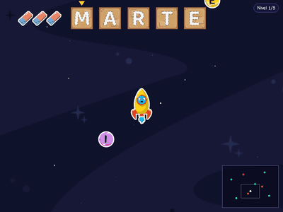
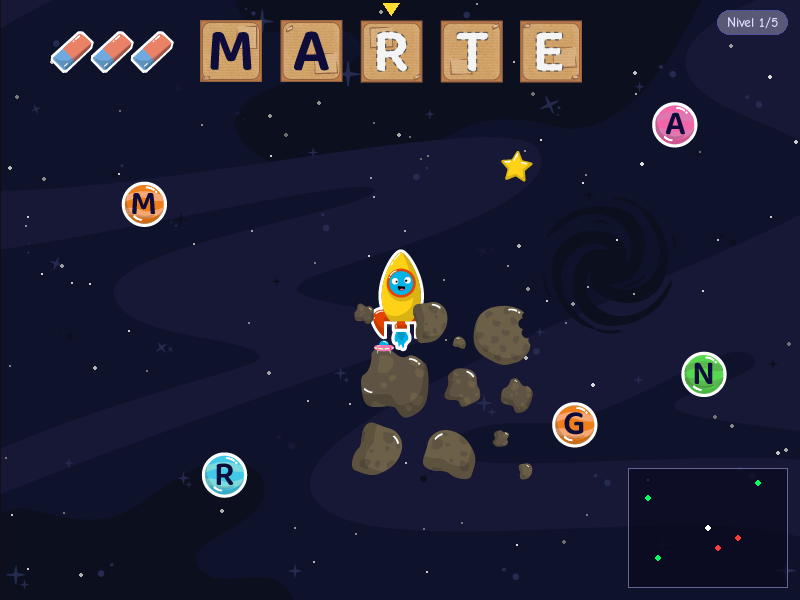
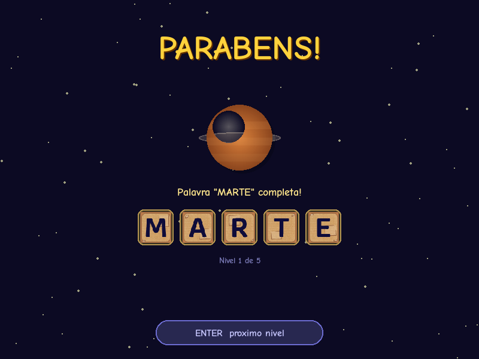
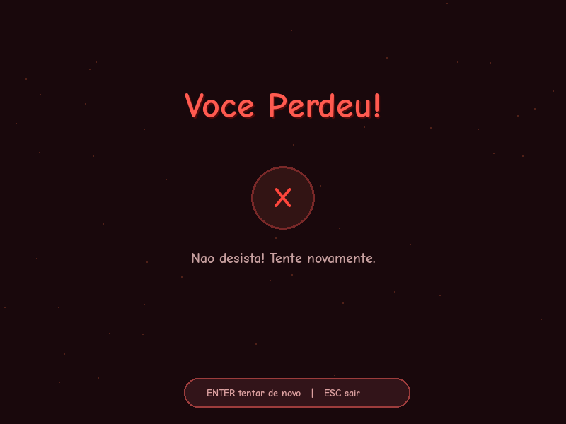

<div align="center">

# Freirinho — jogo espacial educativo

Navegue pelo universo coletando letras para formar palavras

[](https://www.python.org)
[](https://www.pygame.org)

</div>

---

## Demo

<div align="center">

</div>

---

## Sobre o projeto

Freirinho é um jogo 2D educativo com tema espacial feito em Python com Pygame. O jogador controla uma nave e explora um mapa aberto coletando planetas com letras para formar palavras na ordem certa. Desvie de asteroides, evite letras erradas e complete os 5 níveis. Projeto desenvolvido para a disciplina de Introdução à Programação — CIn-UFPE.

---

## Funcionalidades

- Mapa 3x maior que a tela com câmera que segue a nave
- 5 níveis com palavras diferentes: MARTE, TEMA, ARTE, TREM, META
- Coleta em ordem obrigatória — as letras precisam ser pegas na sequência correta
- Seta indicadora no HUD mostra qual é a próxima letra
- Letra coletada fora de ordem desconta uma vida e reaparece em outro lugar do mapa
- Mini-mapa com posição da nave, planetas corretos (verde) e errados (vermelho)
- Dificuldade progressiva com mais obstáculos a cada nível
- Sistema de vidas com power-up de vida extra
- Animações de explosão ao coletar planetas e placar de letras na tela

---

## Tecnologias

- Python — linguagem principal
- Pygame — engine para renderização, sprites, colisões e animações

---

## Como executar

1. Instale as dependências:

```bash
pip install pygame
```

2. Clone o repositório:

```bash
git clone https://github.com/GeozedequeGuimaraes/freirinho-jogo-espacial.git
```

3. Execute o jogo:

```bash
cd freirinho-jogo-espacial
python main.py
```

---

## Controles

| Tecla | Ação |
|-------|------|
| ← ↑ → ↓ / WASD | Move a nave |
| Colidir com letra correta | Coleta a letra e avança na palavra |
| Colidir com letra errada | Perde uma vida |
| ENTER | Reinicia / próximo nível |
| ESC | Sair |

---

## Screenshots





---

## Autor

<div align="center">

Geozedeque Guimarães — Estudante de Ciência da Computação, CIn-UFPE

[](https://github.com/GeozedequeGuimaraes)
[](https://linkedin.com/in/geozedeque-guimaraes)

</div>
